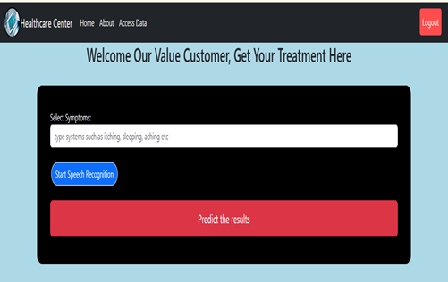

# 🧠 Personalized Treatment Recommendation System

This project is a **machine learning-based web application** designed to provide **personalized medication and treatment suggestions** based on patient data. The system allows users to **sign up or log in**, input health-related information, and receive intelligent treatment recommendations through a trained ML model.

---

## 📸 Interface Screenshot

> 🔺 Make sure your image file is named `interface.png` and placed in the `static/` folder of your project.

---

## 🚀 Features

- ✅ User Signup & Login Authentication (Flask-Login)
- ✅ Personalized treatment recommendations using machine learning
- ✅ Easy-to-use web interface built with Flask + HTML/CSS
- ✅ Text recognition from uploaded medical images using OCR (Tesseract)
- ✅ Dashboard for patient data input and model interaction
- ✅ Deployed using Render

---

## 🛠️ Technologies Used

| Area            | Tools/Packages                          |
|-----------------|------------------------------------------|
| Backend         | Python, Flask                            |
| Frontend        | HTML, CSS, JavaScript                    |
| Machine Learning| scikit-learn, pandas, numpy, joblib      |
| Text Recognition| pytesseract, opencv-python, Pillow       |
| Authentication  | Flask-Login, Flask-WTF, WTForms          |
| Deployment      | Render, gunicorn                         |

---

## 🧩 System Flow

1. **Login/Signup**: Users register or log in to access the system.
2. **Data Input**: Users enter medical data or upload images.
3. **Model Prediction**: Data is passed to a trained ML model to predict treatment.
4. **Recommendation**: Results are shown on the dashboard with treatment suggestions.
